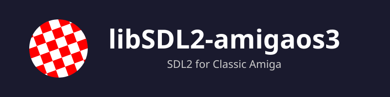
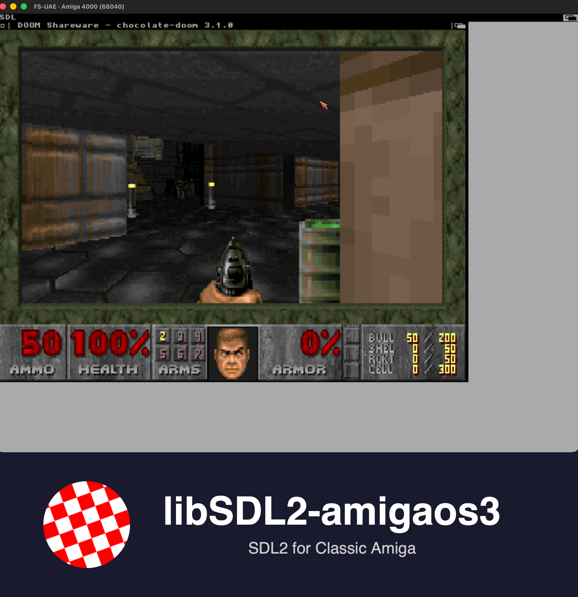

<p align="center">
  
</p>

**SDL2 for AmigaOS 3.x on Motorola 68k** -- the first open-source SDL2 for classic Amiga hardware.

<p align="center">
  
</p>

## What Works

**[Chocolate Doom 3.1.0](https://github.com/bdgscotland/chocolate-doom) runs on this.** Zero patches to id's code. Playable at native 320x200 resolution on an emulated A4000/040 with CyberGraphX RTG. Sound effects working via Paula DMA. Two smaller games also working (2048, Snake).

### API Coverage

```
Subsystem        Status     What Works                        What's Missing
----------------------------------------------------------------------------------
Video            PARTIAL    Window, fullscreen, framebuffer    Cursor, clipboard, gamma
Renderer (SW)    WORKING    FillRect, DrawLine, textures      RenderCopyEx rotation
Audio (Paula)    WORKING    8-bit mono playback, DMA           Stereo, capture
Audio (AHI)      BLOCKED    Code done, FS-UAE stub broken      Needs real hardware
Threading        WORKING    Mutex, semaphore, condvar, TLS     Thread naming
Timer            WORKING    GetTicks, Delay, PerfCounter       --
Input            WORKING    Keyboard, mouse, window events     Relative mouse mode
Joystick         STUB       --                                 Everything
Filesystem       WORKING    GetBasePath, GetPrefPath            --
Haptic/Sensor    N/A        No hardware on classic Amiga
Loadso           N/A        No dlopen on AmigaOS 3.x
```

### What's Been Tested

| Feature | Test |
|---------|------|
| Window creation (windowed + fullscreen) | test_video, game_snake |
| Fullscreen mode switching | game_snake |
| Streaming textures (Lock/Unlock/RenderCopy) | test_texture |
| Logical size scaling (320x240 -> 640x480) | game_snake, test_texture |
| Filled rects, lines | game_2048, game_snake |
| Keyboard and mouse events | test_events, games |
| Paula audio playback | test_audio |
| Threads, mutexes, semaphores | test_threads, testlock, testsem |
| Timer (GetTicks, Delay) | test_timer |
| BMP loading | test_bmpview |

20 automated tests pass. 2 games playable on FS-UAE.

### Test Suite

| Category | Count | Platform |
|----------|-------|----------|
| Automated (pass) | 20 | FS-UAE (all), vamos (11) |
| Manual/Interactive | 15 | FS-UAE only, run individually |
| Upstream SDL2 tests | 19 | From libsdl-org/SDL SDL2 branch |
| Custom tests | 16 | Including test_texture (Doom rendering path) |
| Games | 3 | Chocolate Doom, game_2048, game_snake |

## Hardware Requirements

### Minimum
- AmigaOS 3.x (Kickstart 3.1+)
- **68030 CPU** (minimum target -- RTG cards require 68020+)
- RTG graphics card (CyberGraphX or Picasso96)
- 4 MB Fast RAM (8+ MB recommended)

### Recommended
- 68040+ or accelerator (PiStorm, Vampire)
- 16+ MB Fast RAM
- RTG card or SAGA (Vampire)
- AHI audio system (for 16-bit sound on real hardware)

## Building

```bash
make setup-toolchain   # Pull bebbo-gcc Docker image
make                   # Build libSDL2.a + libSDL2_test.a (cross-compile via Docker)
make examples          # Build test programs + upstream SDL2 tests + games
make test              # Run vamos smoke tests (no GUI)
make test-fsemu        # Run full FS-UAE test suite (RTG + audio)
make clean             # Remove build artifacts
```

**Prerequisites:** Docker, Python + amitools (vamos), FS-UAE (for visual/audio tests).

**Single test:**
```bash
make test-fsemu TEST=test_audio     # Run one automated test
make test-fsemu TEST=game_snake     # Run interactive game
```

## Architecture

SDL2 backends map to AmigaOS subsystems:

| SDL2 Subsystem | AmigaOS Backend | API |
|----------------|----------------|-----|
| Video | CyberGraphX | WritePixelArray, screen modes |
| Renderer | Software (SDL2 built-in) | SDL_RenderFillRect, SDL_RenderCopy, SDL_RenderPresent |
| Audio (Paula) | audio.device | CMD_WRITE, BeginIO/WaitIO, CHIP RAM DMA |
| Audio (AHI) | ahi.device | CMD_WRITE, SendIO, double-buffered |
| Threading | Exec Tasks | CreateNewProc, SignalSemaphore, Signal/Wait join |
| Atomics | Forbid/Permit | Emulated CAS (single-core cooperative) |
| Timer | timer.device | ReadEClock (709 KHz on PAL) |
| Input | Intuition IDCMP | IDCMP_RAWKEY, IDCMP_MOUSEMOVE |
| Float | Software IEEE 754 | Pure integer __divsf3/__mulsf3/__addsf3 |
| Joystick | gameport.device | GPD_ASKCTYPE |
| Filesystem | dos.library | Lock, Examine, PROGDIR: |

### Key Design Decisions

See `docs/adr/` for full Architecture Decision Records:

- **ADR-001: Target 68030 minimum** -- all RTG setups have 68030+
- **ADR-002: SDL_DYNAMIC_API=0** -- no dlopen on AmigaOS 3.x
- **ADR-003: Compile at -O0** -- bebbo-gcc codegen bugs at -O1/-O2
- **ADR-004: Forbid/Permit atomics** -- single-core makes this safe
- **ADR-005: Signal-based thread join** -- ADCD III-17 pattern
- **ADR-006: Paula first, AHI second** -- Paula works on all emulators
- **ADR-007: Lazy device open** -- MsgPort in worker thread context
- **ADR-008: Test tier system** -- 1=vamos, 2=FS-UAE, 12=both, M=manual
- **ADR-009: Upstream test integration** -- -include preamble header
- **ADR-010: Software float library** -- bypasses broken ROM math libs

### Audio Driver Details

Two audio backends are implemented:

- **Paula (audio.device)** -- Primary driver. Uses native Paula DMA with CHIP RAM double-buffering. Works on all Amigas including FS-UAE. 8-bit signed mono, up to 22050 Hz.
- **AHI** -- Secondary driver. Uses the AHI retargetable audio system for 16-bit stereo on sound cards. Code is complete and correct but FS-UAE's AHI emulation is a non-functional stub from 1999. Works on real hardware with AHI installed.

Bootstrap order: Paula -> AHI -> Dummy. SDL2's audio conversion layer handles format conversion (e.g., S16 -> S8) transparently.

### Debug Infrastructure

- **SDL_Log** writes to `WORK:sdl_log.txt` (survives crashes, read from host after FS-UAE exit)
- **DLOG()** macro writes to `WORK:sdl_debug.log` (for backend code, uses Forbid/Permit)
- **test_render_debug** -- step-by-step renderer debugging test
- All debug output persists across Guru crashes -- no screenshot dependency

## References

- **[SDL 1.2 for 68k](https://github.com/AmigaPorts/libSDL12)** -- proven CyberGraphX and AHI backends
- **[SDL2 for AmigaOS 4](https://github.com/AmigaPorts/SDL)** -- SDL2 backend structure reference (PPC)
- **[SDL2 Porting Guide](https://wiki.libsdl.org/SDL2/README-porting)** -- official backend documentation

## License

zlib license (matches SDL upstream). See [LICENSE](LICENSE).
